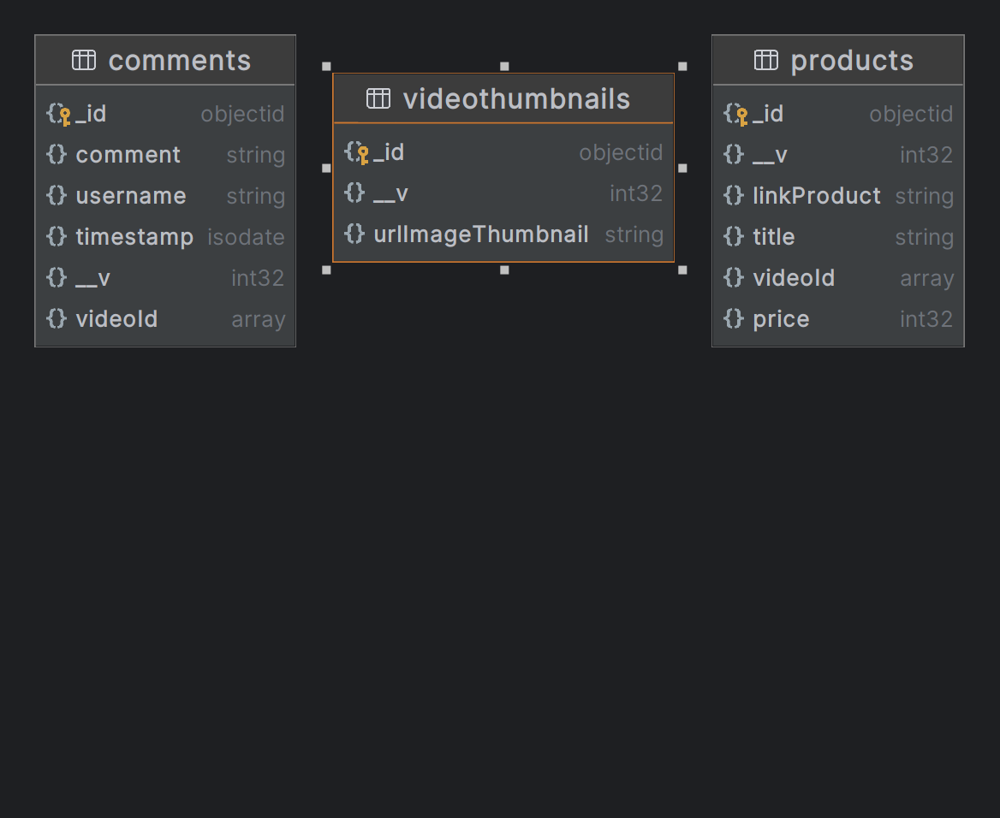

# Project Description
Simple Project for Gigih 3.0 Participant, Mid-Term Project (Backend Only)
## Tech Stack 
- Express JS
- Mongo DB

# Database Explain
The sample tokopedia_play database consists of 3 collections, namely videothumbnails, comments and products.

# API Explain
Request Endpoint Rest API >>> Routes >>> Services >>> Response Rest API 
- VideoThumbnails 
- - - Get or Post VideoThumbnails
- - Products 
- - - Get or Post Products associated with the specified video Id Thumbnails
- - Comments
- - - Get or Post Comments associated with the specified Id Thumbnails
# API Contract
See this file [Api Contract.md](Api%20Contract.md)

# How To Run This Project
## Manual
- Install Node JS
- Install MongoDB
- Running MongoDB
- Using WebStrom IDEA, if you want
- Clone this folder
- Create a file .env
- Copy and Paste this code to .env 
- - `DATABASE_URL= mongodb://127.0.0.1:27017/{change_with_db_name}` 
- - example : `DATABASE_URL= mongodb://127.0.0.1:27017/tokopedia_play`
- Running command `npm install`
- Running `npm start`
- Server started at 3000 
- - `http://localhost/api/{change_with_route_api}`
- See API Contract for detail, You can see [Api Contract.md](Api%20Contract.md)
- Add data manual to database for make VideoThumbnail and Product or You can try adding data with [Api Doc.http](Api%20Doc.http) for test all endpoint api

# API Doc
See this file [Api Doc.http](Api%20Doc.http), how to test api

# Commands
- `npm init`
- `npm install express body-parser mongoose nodemon dotenv`
- `npm start`

created by Antonius Bun Wijaya
